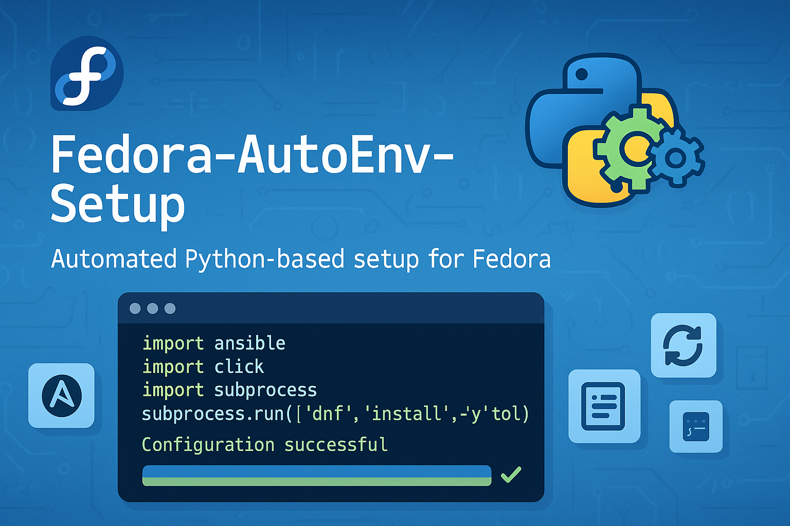

<p align="center">
  
</p>

# Fedora AutoEnv Setup

<p align="center">
  
  
  
</p>

Fedora AutoEnv Setup is a streamlined, configuration-driven tool to automate the setup of a Fedora environment. It simplifies the installation of packages, configuration of system settings, and setup of development tools through a single, easy-to-use script.

## Key Features

- 🚀 **Simplified Installation**: A single command to start the entire setup process.
- ⚙️ **Configuration-Driven**: Easily customize your setup by modifying the `packages.json` file. No need to dig through scripts.
- 🤖 **Automated Processes**: Handles DNF configuration, RPM Fusion setup, package installation (DNF and Flatpak), Nerd Fonts, and more.
- 🖱️ **Interactive and Optional Sections**: Confirm major installation steps like GNOME configuration and NVIDIA driver installation.
- 🧹 **Clean and Organized**: A minimal set of files makes it easy to understand and maintain.
- 📝 **Robust Logging**: All operations are logged to `fedora_autoenv_setup.log` for easy debugging.

## How It Works

The `install.py` script reads all its instructions from the `packages.json` file. This file is organized into logical sections, allowing you to specify:

- DNF performance settings
- DNF and Flatpak packages to install
- Nerd Fonts to download and set up
- Terminal applications and configurations
- Optional GNOME and NVIDIA driver setups

The script executes these tasks sequentially, providing clear feedback and logging everything along the way.

## Prerequisites

- 🖥️ A fresh installation of Fedora Workstation.
- 🌐 An active internet connection.
- 🔒 You must run the script with `sudo`.

## Usage

1. **Clone the repository:**
   ```bash
   git clone https://github.com/your-username/Fedora-AutoEnv-Setup.git
   cd Fedora-AutoEnv-Setup
   ```

2. **Customize your setup (Optional):**
   Open the `packages.json` file and edit it to match your desired setup. You can add or remove packages, change DNF settings, or disable entire sections.

3. **Run the installation script:**
   ```bash
   sudo python3 install.py
   ```

The script will guide you through the installation process, asking for confirmation for major steps.

## Configuration (`packages.json`)

Here’s a brief overview of the `packages.json` structure:

- `"dnf_settings"`: An object containing key-value pairs for settings in `/etc/dnf/dnf.conf`.
- `"dnf_packages"`: A list of DNF packages to be installed.
- `"flatpak_apps"`: A dictionary where keys are Flatpak application IDs and values are their friendly names.
- `"terminal_packages"`: A list of DNF packages for terminal enhancement (e.g., `ghostty`, `fish`).
- `"nerd_fonts"`: A dictionary to specify Nerd Fonts to install, with font names as keys and download URLs as values.
- `"gnome_configuration"`: An optional section for GNOME-related packages.
- `"nvidia_installation"`: An optional section for NVIDIA driver packages.

### Example `packages.json`:
```json
{
  "dnf_settings": {
    "max_parallel_downloads": 10,
    "fastestmirror": true
  },
  "dnf_packages": [
    "git",
    "curl",
    "vim"
  ],
  "flatpak_apps": {
    "com.spotify.Client": "Spotify"
  },
  "terminal_packages": [
    "fish"
  ]
}
```

## Contributing

Contributions are welcome! If you have ideas for improvements or new features, feel free to open an issue or submit a pull request.

## License

This project is licensed under the MIT License. See the [LICENSE](LICENSE) file for details.
